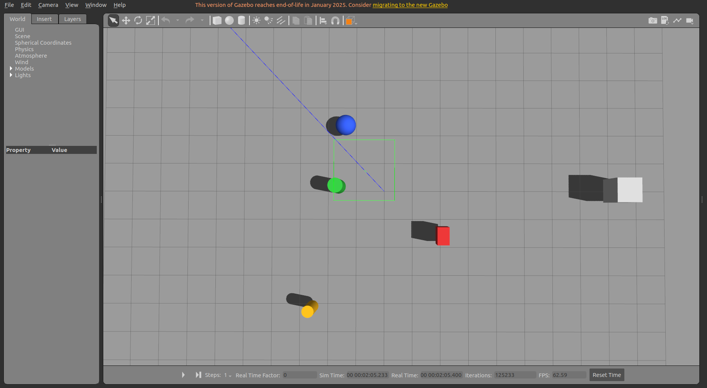

# moving_obstacle_sim

[English Version](./README_en.md)

`moving_obstacle_sim` 是一个 **ROS1 Noetic + Gazebo11** 的动态障碍物软件包，可以在 Gazebo 中生成和控制障碍物。

## 1. 项目特性

- 支持障碍物基础几何体：`box` / `sphere` / `cylinder`
- 模型完整包含：`visual + collision + inertial`
- C++ `ModelPlugin` 支持 6 种运动：
  - `static`
  - `line`
  - `sine`
  - `circle`
  - `ellipse`
  - `polygon`
- 统一运动控制参数：
  - `enabled`
  - `speed`
  - `mode` (`loop` / `ping_pong` / `once`)
  - `align_yaw`
  - `z_lock`
  - `bounds`（固定 `bounce` 反弹）
- 单一 YAML 同时描述静态和动态障碍物
- 支持多类型、多实例、批量生成
- `main.launch` 默认 **不生成机器人**，仅启动 Gazebo + 障碍物

## 2. 项目组成

```text
moving_obstacle_sim/
  CMakeLists.txt
  package.xml
  install.sh                                # 一键安装依赖脚本
  README.md                                 # 中文说明
  README_en.md                              # 英文说明
  include/moving_obstacle_sim/moving_obstacle_plugin.h
  src/moving_obstacle_plugin.cpp            # 轨迹控制核心插件
  scripts/spawn_moving_obstacles.py         # 读取YAML并调用gazebo/spawn_sdf_model
  scripts/model_builders.py                 # 构造SDF(几何/惯量/插件参数映射)
  launch/main.launch                        # 独立运行入口(Gazebo+障碍物)
  launch/spawn_moving_obstacles.launch      # 注入到已有Gazebo会话
  launch/include/spawn_from_config.launch.xml
  config/moving_obstacles_demo.yaml         # 演示配置
  config/moving_obstacles_all_modes.yaml    # 全模式示例
  models/                                   # 参考模板SDF
  urdf/primitive_obstacles.urdf.xacro       # URDF/xacro兼容模板
  docs/images/                              # README截图占位目录
```

## 3. 环境要求

- Ubuntu 20.04（推荐）
- ROS1 Noetic
- Gazebo11（Gazebo Classic）
- Catkin 工作空间

## 4. 部署步骤（发布到 GitHub 后可直接用）

以下流程适用于首次拉取并部署。

1. 创建工作空间并 clone 项目

```bash
mkdir -p ~/catkin_ws/src
cd ~/catkin_ws/src
git clone https://github.com/LiO2-coder/moving_obstacle_sim.git
```

2. 一键安装依赖

```bash
cd ~/catkin_ws/src/moving_obstacle_sim
chmod +x install.sh
./install.sh
```

可选参数：

```bash
./install.sh --rosdistro noetic
./install.sh --workspace ~/catkin_ws
./install.sh --skip-apt
./install.sh --skip-rosdep-init
```

3. 编译

```bash
cd ~/catkin_ws
catkin_make
source devel/setup.bash
```

## 5. 运行方式

### 5.1 独立启动（仅 Gazebo + 障碍物）

```bash
roslaunch moving_obstacle_sim main.launch
```

使用全模式示例配置：

```bash
roslaunch moving_obstacle_sim main.launch \
  obstacles_config:=pkg://moving_obstacle_sim/config/moving_obstacles_all_modes.yaml
```

### 5.2 注入到已有 Gazebo 会话

```bash
roslaunch moving_obstacle_sim spawn_moving_obstacles.launch \
  config:=pkg://moving_obstacle_sim/config/moving_obstacles_demo.yaml
```

### 5.3 在其他软件包中调用

在你的 launch 文件中 include：

```xml
<include file="$(find moving_obstacle_sim)/launch/spawn_moving_obstacles.launch">
  <arg name="config" value="pkg://your_pkg/config/your_obstacles.yaml" />
  <arg name="reference_frame" value="world" />
  <arg name="delete_if_exists" value="false" />
</include>
```

## 6. 配置说明（YAML）

核心结构：

```yaml
obstacles:
  - name: obs_box_1
    enabled: true
    shape:
      type: box # box | sphere | cylinder
      mass: 3.0
      box_size: [0.6, 0.4, 1.0]
      radius: 0.3
      length: 1.0
      color_rgba: [0.8, 0.2, 0.2, 1.0]
    pose:
      xyz: [2.0, 0.0, 0.5]
      rpy: [0.0, 0.0, 0.0]
    motion:
      enabled: true
      type: line # static | line | sine | circle | ellipse | polygon
      speed: 0.6
      mode: ping_pong # loop | ping_pong | once
      align_yaw: true
      z_lock: true
      bounds:
        enabled: false
        x_min: -10.0
        x_max: 10.0
        y_min: -10.0
        y_max: 10.0
      line:
        p0: [2.0, -2.0]
        p1: [2.0, 2.0]
      sine:
        axis: x
        x_min: -2.0
        x_max: 2.0
        center: 0.0
        amplitude: 1.0
        wavelength: 4.0
        phase: 0.0
      circle:
        center: [0.0, 0.0]
        radius: 1.5
        clockwise: false
        theta0: 0.0
      ellipse:
        center: [0.0, 0.0]
        a: 2.0
        b: 1.0
        yaw: 0.0
        clockwise: false
        theta0: 0.0
      polygon:
        points: [[0, 0], [2, 0], [2, 2], [0, 2]]
        close_loop: true
```

## 7. 运行截图




## 8. 常见验证

1. 检查插件库是否生成

```bash
ls ~/catkin_ws/devel/lib/libmoving_obstacle_plugin.so
```

2. 检查模型状态话题

```bash
rostopic echo -n 1 /gazebo/model_states
```

3. 参数非法时自动降级静止（并输出 `ROS_WARN`）

- `speed <= 0`
- 线段长度为 0
- `circle.radius <= 0`
- `ellipse.a <= 0` 或 `ellipse.b <= 0`
- 多边形点数量不足或退化
